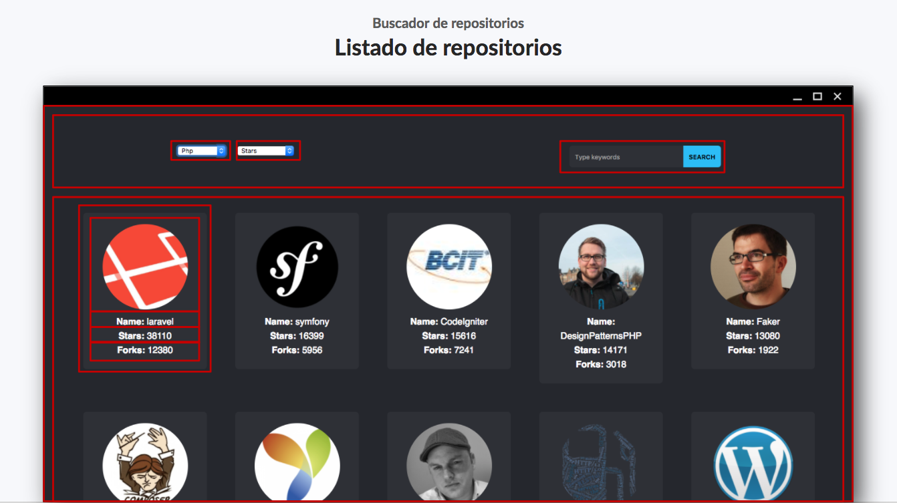
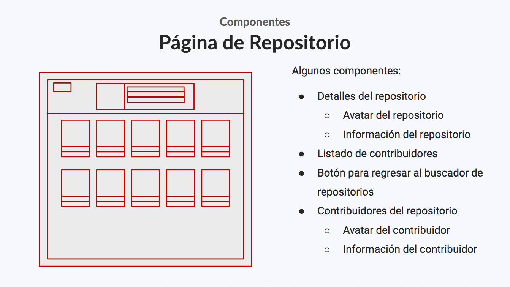

# Reutilización

Como ya se ha mencionado durante el curso `ReactJS` está orientado a la creación de componentes independientes y que puedan funcionar como un todo por si solos. Esto hace que puedan reutilizarse.

## Identificando componentes

Lo primero a realizar en esta sección es analizar el diseño de nuestra aplicación pantalla por pantalla. Tenemos dos pantallas:

* Buscador de repositorios
* Página de un repositorio

## Buscador de repositorios

### Diseño

En esta pantalla podremos:

* Ver un listado de repositorios
* Buscar un repositorio por nombre
* Filtrar el listado por lenguaje de programación
* Filtrar el listado por número de estrellas
* Filtrar el listado por número de *forks*
* Filtrar el listado por fecha de última actualización

</br>

<p align='center'>

</p>

### Componentes

<p align='center'>

</p>

## Página de un repositorio

### Diseño

En esta pantalla podremos:

* Ver la información detallada del repositorio seleccionado
* Ver un listado de contribuidores del repositorio seleccionado
* Regresar a la página principal (Listado de repositorios)

</br>

<p align='center'>

</p>

### Componentes

<p align='center'>

</p>

## Componentes reutilizables

En la carpeta de `snippets/reusable-components` podrás encontrar los componentes reutilizables que usaremos para construir nuestra aplicación.

Estos componentes reutilizables deberán ser copiados dentro de la carpeta `repo-browser/src/components` de nuestro proyecto. Finalmente tu carpeta deberá contener:

* Card
  * components/
    * CardAvatar/
    * CardDetails/
    * CardItem/
    * CardLink/
  * Card.css
  * Card.js
* Grid
  * Grid.css
  * Grid.js
* LoadingSpinner
  * LoadingSpinner.css
  * LoadingSpinner.
  
A continuación se presenta el código JSX de cada uno de los componentes que hemos creado para ti en este curso.

### LoadingSpinner

```jsx
import React from 'react';

import './LoadingSpinner.css';

const LoadingSpinner = () => (
    <div className="loading-spinner"/>
);

export default LoadingSpinner;
```

### Grid

```jsx
import React from "react";
import './Grid.css';

const Grid = ({children, noItemsMessage = 'No items'}) => {

    if (React.Children.count(children) === 0) {
        return <div>{noItemsMessage}</div>;
    }

    return (
        <div className="grid">
            {children}
        </div>
    );
};

export default Grid;
```

### Card

```jsx
import React from 'react';
import classnames from 'classnames';

import './Card.css';
import CardDetails from "./components/CardDetails/CardDetails";
import CardAvatar from "./components/CardAvatar/CardAvatar";
import CardItem from "./components/CardItem/CardItem";
import CardLink from "./components/CardLink/CardLink";


const Card = ({children, className}) => (
    <div className={classnames("card", className)}>
        {children}
    </div>
);

export {
    CardDetails,
    CardAvatar,
    CardItem,
    CardLink
};
export default Card;
```

## Playground

Ahora que tienes los componentes reutilizables que hemos creado para ti en este curso, puedes jugar con ellos y utilizalos dentro de tu archivo `repo-browser/App.js`

Para este caso deberás agregar el archivo de estilos que se encuentra en `snippets/App.css`. El contenido de este archivo debe reemplazar al generado por `create-react-app`.

```jsx
import React, { Component } from 'react';
import './App.css';

import LoadingSpinner from './components/LoadingSpinner/LoadingSpinner';

class App extends Component {
  render() {
    return (
      <div>
        <LoadingSpinner />
      </div>
    );
  }
}

export default App;
```

### Usando el componente `Card`

Utilizando el modelo `Contributor` y el componente `Card` podemos generar un nuevo componente para mostrar la información de un contribuidor en formato de tarjeta:

```jsx
import React from 'react';
import Card, {CardItem, CardDetails, CardAvatar, CardLink} from "../../../../../components/Card/Card";

const ContributorCard = ({contributor}) => (
    <Card>
        <CardAvatar imageSrc={contributor.avatarUrl}/>
        <CardDetails>
            <CardItem label="Name">{contributor.loginName}</CardItem>
            <CardLink href={contributor.githubPageLink}>Github</CardLink>
        </CardDetails>
    </Card>
);

export default ContributorCard;
```