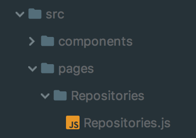
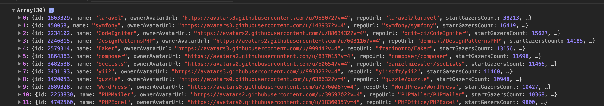
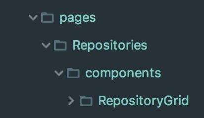
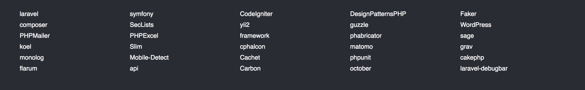
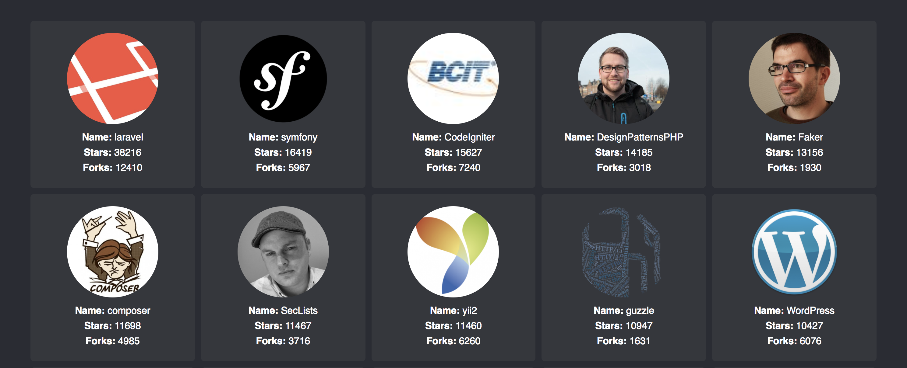
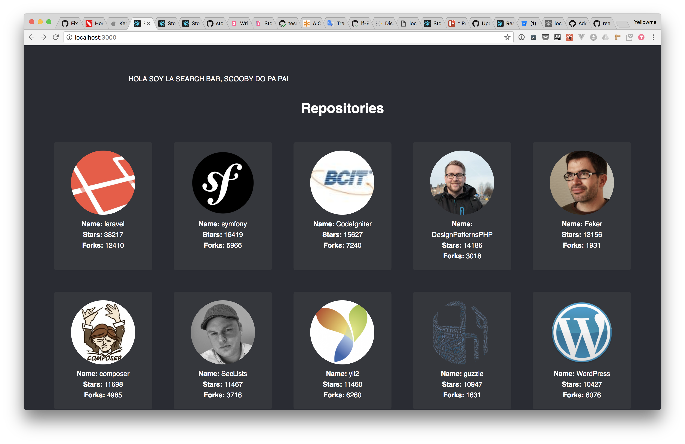
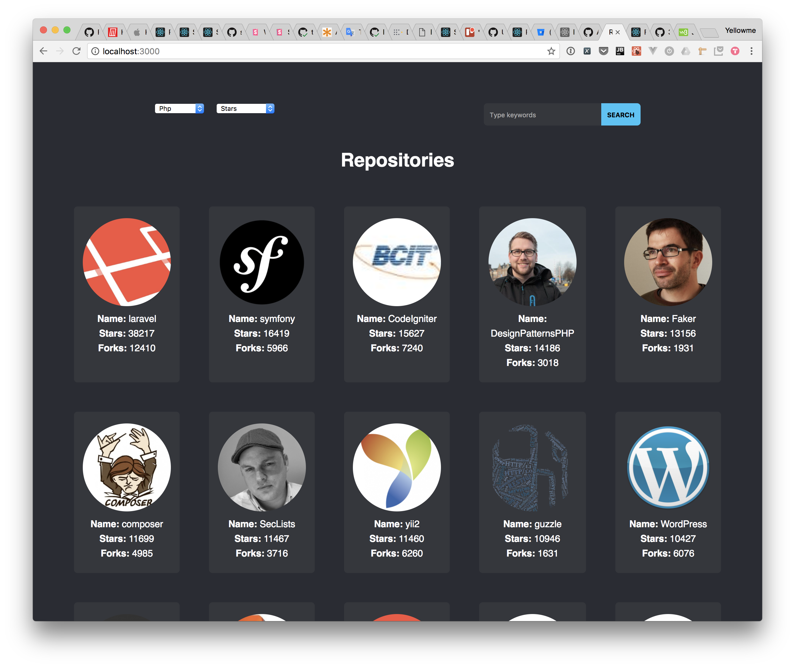
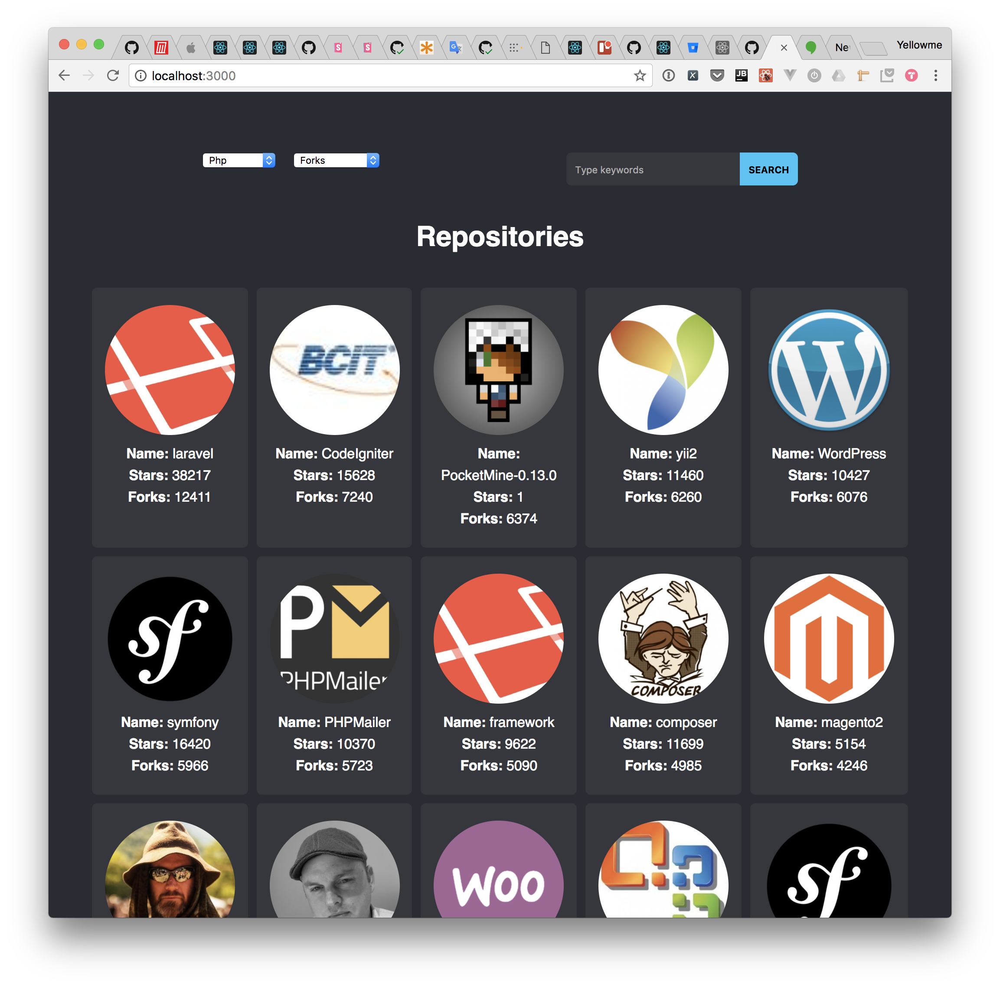

# Grilla de Repositorios

## Antes de iniciar 

Obtén el código base para continuar desde esta sección:

```bash
git fetch origin
git checkout starter-mile-02
npm install
```

## Coding Time

Ahora iremos paso a paso creando la primera página de la aplicación. Lo primero que haremos será crear una página nueva llamada Repositories. Hay que recordar que las páginas son componentes de React, la única diferencia es que estas están relacionadas a una URL. En este caso la página **Repositories** está relacionada con la url raíz de nuestro sitio  (“/”). 

La página **Repositories** debe tener la siguiente estructura inicial en nuestro directorio. 

<p align='center'>

</p>

Dentro del archivo `Repositories.js` creemos la estructura base de nuestro componente. 

```js
import React, {Component} from 'react';


class Repositories extends Component {

    render() {
        return null;
    }
    
}

export default Repositories;
```

Hagamos que el componente  `App`   utilize el componente que acabamos de sacar del horno. 

```js
//App.js
import React, {Component} from 'react';

import './App.css';
import Repositories from "./pages/Repositories/Repositories";
class App extends Component {

    render() {
        return (
            <div className="app">
                <Repositories/>
            </div>
        );
    }
}

export default App;
```

Ahora importemos el archivo `githubClient` en la parte de arriba de nuestro archivo `Repositories.js`.

```
//Repositories.js
import React, {Component} from 'react';
import * as githubClient from "../../services/githubClient/githubClient";
```

Este archivo contiene la función `getRepositories` con la siguiente firma: 
``` js
getRepositories(searchQuery = '', language = '',sortBy = '')
```

Asegurémonos que el método nos devuelve una lista de repositorios agregándolo al método `componentDidMount`   de nuestro componente `Repositories`.


```js
import React, {Component} from 'react';


class Repositories extends Component {

    componentDidMount() {
        githubClient.getRepositories('', 'php')
            .then(repositoriesList => {
                console.log(repositoriesList);
            });
    } 

    render() {
        return null;
    }
    
}

export default Repositories;
```

Entremos a `localhost:3000` y si todo salió bien deberías de ver lo siguiente en la consola del navegador:

<p align='center'>

</p>

Ya podemos obtener los repositorios es hora de guardarlos en el `state`, así React sabrá que cuando se obtengan los repositorios el componente `Repositories` debe de renderizarse de nuevo.

```js
import React, {Component} from 'react';


class Repositories extends Component {

    state = {
        repositoriesList: []
    };

    componentDidMount() {
        githubClient.getRepositories('', 'php')
            .then(repositoriesList => {
		        this.setState({repositoriesList});
            });
    } 

    render() {
        return null;
    }
    
}

export default Repositories;
```


## Componente RepositoriesGrid

Agreguemos un componente nuevo llamado `RepositoriesGrid`. Este componente solo será utilizado por el componente `Repositories` por lo que debe de ir dentro de su carpeta `components`.


<p align='center'>

</p>


`RepositoriesGrid` será el encargado de manejar el grid de repositorios (un poco obvio). Este componente será un `functional stateless component` debido a que no maneja estado(state) y solo se encarga de renderizar la información que se le pase via props.

```js
import React from "react";
import PropTypes from 'prop-types';
import Grid from "../../../../components/Grid/Grid";

import './RepositoriesGrid.css';

const RepositoriesGrid = ({repositoriesList}) => {
    return (
        <Grid noItemsMessage="No results found">
            {repositoriesList.map(repository => (
                <div key={repository.id}>{repository.repoUrl}</div>
            ))}
        </Grid>
    );
};

RepositoriesGrid.propTypes = {
    repositoriesList: PropTypes.arrayOf(PropTypes.shape({
        id: PropTypes.number.isRequired,
        repoUrl: PropTypes.string.isRequired,
    })).isRequired
};

export default RepositoriesGrid;
```

Es importante definir los props que son necesarios para que el componente se renderice correctamente. En este caso definimos que el componente  `RepositoriesGrid ` espera que le pasen via prop un `repositoriesList` el cual es un array de objetos. Donde cada objeto debe tener un `id` (número) y un `repoUrl` (string).

En el archivo `Repositories` importa el componente `RepositoriesGrid` y úsalo para renderizar la lista de repositorios.

```js
//Repositories.js
render() {
        const {repositoriesList} = this.state;
        return (
            <div className="repositories">
                <RepositoriesGrid repositoriesList={repositoriesList}/>
            </div>
        );
    }
```


Si todo salió bien al entrar a tu navegador deberías de ver algo como esto: 

<p align='center'>

</p>

El componente `Grid` tiene la funcionalidad de separar a sus hijos en una grilla de 5 columnas por N filas. Si entras a ver el código verás que es un solo `div` que utiliza los estilos de `grid-layout` de `css`.

Ya tenemos los repositorios y están ordenados; agreguemos las tarjetas para cada uno. Creemos un nuevo componente `RepositoryCard`en la carpeta `components` de `RepositoryGrid`. 

`RepositoryCard` debe recibir un objeto `repository` que contenga toda la información que será mostrada en la tarjeta. De nueva cuenta, debido a que este componente no maneja estados podemos hacer uso de un `functional stateless component`. El componente hará uso de las clases reutilizables `Card`, `CardAvatar`, `CardDetails` y `CardItem` y debe verse así:

```js
//RepositoryCard.js
import React from 'react';
import PropTypes from 'prop-types';
import Card, {CardAvatar, CardDetails, CardItem} from "../../../../../../components/Card/Card";

import './RepositoryCard.css';

const RepositoryCard = ({repository}) => (
    <Card className="repositories__card">
        <CardAvatar imageSrc={repository.ownerAvatarUrl}/>
        <CardDetails>
            <CardItem label="Name">{repository.name}</CardItem>
            <CardItem label="Stars">{repository.startGazersCount}</CardItem>
            <CardItem label="Forks">{repository.forksCount}</CardItem>
        </CardDetails>
    </Card>
);


RepositoryCard.propTypes = {
    repository: PropTypes.shape({
        ownerAvatarUrl: PropTypes.string,
        name: PropTypes.string.isRequired,
        startGazersCount: PropTypes.number.isRequired,
        forksCount: PropTypes.number.isRequired,
    }).isRequired,
};

export default RepositoryCard;
```

Importemos nuestro nuevo componente en `RepositoryGrid` y usémoslo.

```js
//RepositoryGrid.js
import React from "react";
import PropTypes from 'prop-types';

import RepositoryCard from "./components/RepositoryCard/RepositoryCard";
import Grid from "../../../../components/Grid/Grid";

import './RepositoriesGrid.css';


const RepositoriesGrid = ({repositoriesList}) => {
    return (
        <Grid noItemsMessage="No results found">
            {repositoriesList.map(repository => (
                    <RepositoryCard
                        key={repository.id} //<-- No olvidemos el key
                        repository={repository}
                    />
            ))}
        </Grid>
    );
};

RepositoriesGrid.propTypes = {
    repositoriesList: PropTypes.arrayOf(PropTypes.shape({
        id: PropTypes.number.isRequired,
        repoUrl: PropTypes.string.isRequired,
    })).isRequired
};

export default RepositoriesGrid;

```

Si todo salió bien al entrar a nuestro navegador deberíamos de ver algo como esto: 


<p align='center'>

</p>

Tal vez hayas notado que al recargar la página antes de que se muestren los repositories sale un mensaje de “no content”. Este mensaje lo pone por defecto el componente `Grid` pero solo debería mostrarse cuando le pasas una lista vacía. El problema es cuando se monta por primera vez nuestro componente `Repositories` el valor de `repositoriesList` es un array vacío. Agreguemos una nueva variable llamada `loading` que será la encargada de decirnos si ya se han solicitado o no los repositorios al cliente `githubClient`. 

```js
//Repositories.js
import React, {Component} from 'react';
import * as githubClient from "../../services/githubClient/githubClient";
import RepositoriesGrid from "./components/RepositoryGrid/RepositoryGrid";
import './Repositories.css';

class Repositories extends Component {

    state = {
        repositoriesList: [],
        loading: false // <-- agregar valor inicial
    };

    componentDidMount() {
        this.setState({loading: true}); // <-- Empezaremos a pedir los repos
        return githubClient.getRepositories('', 'php')
            .then(repositoriesList => {
                this.setState({
                    repositoriesList,
                    loading: false //<-- Ya terminamos de pedirlos
                });
            });
    }


    render() {
             // Obtenemos los repositorios y el estado de loading 
	 //Si loading es falso, renderizar RepositoriesGrid 
        const {repositoriesList, loading} = this.state;
        return (
            <div className="repositories">
                {!loading && ( 
                    <RepositoriesGrid repositoriesList={repositoriesList}/>
                )}
            </div>
        );
    }
}

export default Repositories;

```


El mensaje ya no debe aparecer. Pero vamos a **METERLE MÁS DISEÑO**. Agreguemos el componente `LoadingSpiner` de la siguiente manera:

```js
//Repositories.js
render() {
        const {repositoriesList, loading} = this.state;
         //  Si loading es true mostremos el loading
         //  Si loading es false mostremos el grid
        return (
            <div className="repositories">
	        {loading ?
                    (<LoadingSpinner/>)
                    :
                    (<RepositoriesGrid repositoriesList={repositoriesList}/>)
                }
            </div>
        );
    }
```


Como toque final agreguemos un título para que nuestra grilla de repositorios se va muy bonita. 

```js
//Repositorioes.js
render() {
        const {repositoriesList, loading} = this.state;
        return (
            <div className="repositories">
.                <div className="repositories__title">
                    <h1>Repositories</h1>
                </div>
                {loading ?
                    (<LoadingSpinner/>)
                    :
                    (<RepositoriesGrid repositoriesList={repositoriesList}/>)
                }
            </div>
        );
    }
```

## Componente RepositorySearchBar

Ya que podemos mostrar los repositorios, ahora agreguemos la capacidad de buscarlos. Iniciemos creando un componente `RepositorySearchBar` que será un sub-componente de `Repositories`.

```js
// RepositorySearchBar.js
import React, {Component} from "react";

import './RepositorySearchBar.css';

class RepositorySearchBar extends Component {
    render() {
        return (
            <form
                className="repositories__search-form"
            >
                HOLA SOY LA SEARCH BAR, SCOOBY DO PA PA! 
            </form>
        );
    }
}

export default RepositorySearchBar;

```

Agreguemos  `RepositorySearchBar`  dentro del método `render` de `Repositories`.

```js
//Repositories.js
render() {
        const {repositoriesList, loading} = this.state;
        return (
            <div className="repositories">
                <RepositorySearchBar onSearchSubmit={this.handleSearchSubmit}/>
                <div className="repositories__title">
                    <h1>Repositories</h1>
                </div>
                {loading ?
                    (<LoadingSpinner/>)
                    :
                    (<RepositoriesGrid repositoriesList={repositoriesList}/>)
                }
            </div>
        );
    }
```

Si entras al navegador debería de aparecer esta preciosura:

<p align='center'>

</p>


Antes de empezar a agregar los campos de búsqueda aprendamos que son los **controlled components**. 

### Controlled components crash coursito

Elementos como  `<input/>` o `<select/>` normalmente manejan su estado por si mismos. Sin embargo si queremos usar **React** para manipular su valor, es necesario que definamos dos props values; el prop _value_ y el prop _onChange_. 

El prop _value_ nos permite definir el valor que debe aparecer en el elemento, y el prop _onChange_ nos permite suscribirnos a un evento que es disparado cada vez que algo o alguien causa un cambio en el estado del elemento. 

Por ejemplo, cambiemos por un momento nuestro archivo App.js a lo siguiente: 

```js
import React, {Component} from 'react';
import AppRoutes from "./components/AppRoutes/AppRoutes";

import './App.css';

class App extends Component {
    state = {value: ''};

    handleChange = (event) => {
        this.setState({value: event.target.value});
    };

    render() {
        return (
            <label>Name:<input type="text" value={this.state.value} onChange={this.handleChange}/></label>
        );
    }
}

export default App;

```

Este deberá de mostrar lo siguiente en el navegador: 


Debes poder escribir como si fuera un input normal, lo sé, no hay mucha magia aquí, se comporta tal y como se esperaba. Si tienes instalado el React Web tools, ábrelo para que veamos como el `state` del componente va cambiando cada vez que modificamos el input. 

Algo que nos permite **React** es utilizar el prop _value_ en un elemento input es poder manipular su valor desde otro lugar. Por ejemplo podríamos poner un valor inicial: 

```js
import React, {Component} from 'react';
import AppRoutes from "./components/AppRoutes/AppRoutes";

import './App.css';

class App extends Component {
    state = {value: 'SOY UN VALOR INICIAL WOW'};

    handleChange = (event) => {
        this.setState({value: event.target.value});
    };

    render() {
        return (
            <label>Name:<input type="text" value={this.state.value} onChange={this.handleChange}/></label>
        );
    }
}

export default App;

```

Hagamos un ejemplo más, donde hay 2 inputs donde no importa en donde escribas los dos siempre tendrán el mismo mensaje. 

```js
import React, {Component} from 'react';

import './App.css';

class App extends Component {
    state = {value: ''};

    handleChange = (event) => {
        this.setState({value: event.target.value});
    };

    render() {
        return (<div>
                <label>Original:<input type="text" value={this.state.value}
                                       onChange={this.handleChange}/></label>
                <br/>
                <label>Copy:<input type="text" value={this.state.value}
                                    onChange={this.handleChange}/></label>
            </div>
        );
    }
}

export default App;
```

Regresemos a la normalidad nuestro componente `App` (pueden verlo arriba más arriba en esta guía). Ahora sigamos trabajando en el `RepositorySearchBar `. Si vemos el diseño de nuestra lujosa aplicación podemos observar que nuestra search bar se compone por dos dropdowns, un input y un botón. Vamos a agregarlos. 

```js
import React, {Component} from "react";
import './RepositorySearchBar.css';

class RepositorySearchBar extends Component {

    render() {
        return (
            <form
                className="repositories__search-form"
            >
                <select

                    className="repositories__search-language-dropdown"
                >
                    <option value="php">Php</option>
                    <option value="ruby">Ruby</option>
                    <option value="javascript">Javascript</option>
                </select>
                <select

                    className=".repositories__search-sort-dropdown"
                >
                    <option value="stars">Stars</option>
                    <option value="forks">Forks</option>
                    <option value="updated">Last updated</option>
                </select>
                <input
                    placeholder="Type keywords"
                    className="repositories__search-text-input"
                    type="text"
                />
                <button
                    className="repositories__search-button"
                    type="submit"
                >
                    Search
                </button>
            </form>
        );
    }
}


export default RepositorySearchBar;

```
 
No se a ti, pero a mi me dio dolor ocular la cantidad de HTML que hay ahí, pero funciona, se ve correctamente nuestra aplicación.

<p align='center'>

</p>

Hagamos un poco de limpieza creando sub-componentes para cada elemento del form. En total serán 3 sub-componentes: 

#### Sub-componentes

*  `LanguageDropdown`
* `SortDropdown`
* `SearchBarInput`


Mostraré como hacer el componente `SortDropdown` y dejaré a la capacidad del lector hacer los demás.

Movamos todo el select con la clase `repositories__search-sort-dropdown ` a su propio componente. Recuerda ponerlo dentro de la carpeta `components` del componente `RepositorySearchBar`. 

Nuestro archivo `SortDropDown.js` debe verse así:

```js
import React from 'react';

const SortDropdown = () => (
    <select
        className=".repositories__search-sort-dropdown"
    >
        <option value="stars">Stars</option>
        <option value="forks">Forks</option>
        <option value="updated">Last updated</option>
    </select>
);

export default SortDropdown;

```

Luego de crear todos los subcomponentes el método `render` de `RepositorySearchBar` ya no debe darte ganas de replantearte tu selección de carrera y también de verse algo como así:

```js
	render() {
        return (
            <form className="repositories__search-form">
                <LanguageDropdown/>
                <SortDropdown/>
                <SearchBarInput/>
                <button className="repositories__search-button" type="submit">
                    Search
                </button>
            </form>
        );
    }
``` 


Un componente solo debe de tener en su estado datos que le interesen, en este caso, podríamos dejar que cada sub-componente maneje su propio estado y hacer que el componente padre (`RepositorySearchBar`) les solicite su estado actual cada vez que el usuario haga clic en el botón “Search”. Eso suena complicado y por suerte hay una mejor manera. 

Hagamos que `RepositorySearchBar` sea el encargado de guardar el estado de sus hijos, de esta manera no tenemos que estarles pidiendo su valor actual cada vez que queramos hacer una búsqueda. 

Cómo se hizo anteriormente les mostraré como hacer que el padre (`RepositorySearchBar`) guarda el estado de uno de sus hijos y queda a discreción del lector hacer los demás.

Primero agreguemos los props _value_ y _onChange_ al sub-componente `SortDropdown` y agreguemos uno más, el prop _name_. Este será usado por el padre para saber de quien es el estado que tiene que guardar. 

Nuestro archivo `SortDropdown ` debe verse de la siguiente manera:

```js
import React from 'react';
import PropTypes from 'prop-types';

const SortDropdown = ({name, value, onChange}) => (
    <select
        name={name}
        className=".repositories__search-sort-dropdown"
        onChange={onChange}
        value={value}
    >
        <option value="stars">Stars</option>
        <option value="forks">Forks</option>
        <option value="updated">Last updated</option>
    </select>
);

SortDropdown.propTypes = {
    name: PropTypes.string.isRequired,
    onChange: PropTypes.func.isRequired,
    value: PropTypes.string.isRequired,
};

export default SortDropdown;

```

No olviden que los PROP-TYPES son importantes.

Dentro de nuestro componente `RepositorySearchBar` agreguemos en el estado, el valor inicial de `SortDropdown`  y el método que utilizaremos para suscribirnos a sus cambios.

```js
import React, {Component} from "react";

import SearchBarInput from "./components/SearchBarInput/SearchBarInput";
import LanguageDropdown from "./components/LanguageDropdown/LanguageDropdown";
import SortDropdown from "./components/SortDropdown/SortDropDown";

import './RepositorySearchBar.css';

class RepositorySearchBar extends Component {
    state = {
        sortBy: 'stars',
    };

    handleOnChange = (event) => {
        const {value, name} = event.target;
        this.setState({[name]: value});
    };

    render() {
        const {sortBy} = this.state;
        return (
            <form
                className="repositories__search-form"
            >
                <LanguageDropdown/>
                <SortDropdown name="sortBy" value={sortBy} onChange={this.handleOnChange}/>
                <SearchBarInput/>
                <button className="repositories__search-button" type="submit">
                    Search
                </button>
            </form>
        );
    }
}

export default RepositorySearchBar;

```

La función handleOnChange recibe un evento del navegador, este evento trae consigo el valor actual del elemento al igual que su nombre. De esta manera nosotros podemos utilizar esta función para manejar los cambios para todos los sub-componentes. Revisemos que funciona en **React Web tools**y si todo está bien, es momento de agregar lo necesario para hacer la búsqueda. 

## YA POR FIN VAMOS A BUSCAR REPOSITORIOS!

En React podemos suscribirnos al evento `onSubmit` de un form así que utilicemos este evento para disparar la búsqueda de repositorios. Primero hay que suscribirnos via props al evento y luego hay que prevenir el comportamiento por defecto del submit. En este caso el encargado de hacer la búsqueda será el componente `Repositories` así que utilizaremos el prop `onSearchSubmit` para mandarle el estado actual de los campos de búsqueda.

Nuestro `RepositorySearchBar` debió de quedar de la siguiente manera: 

```js
RepositorySearchBar.js
import React, {Component} from "react";
import PropTypes from 'prop-types';

import SearchBarInput from "./components/SearchBarInput/SearchBarInput";
import LanguageDropdown from "./components/LanguageDropdown/LanguageDropdown";
import SortDropdown from "./components/SortDropdown/SortDropDown";

import './RepositorySearchBar.css';

class RepositorySearchBar extends Component {
    state = {
        searchQuery: '',
        language: 'php',
        sortBy: 'stars',
    };

    //Método que sirve para manejar el envio del evento
    handleOnSubmit = (event) => {
        event.preventDefault();
        const {onSearchSubmit} = this.props;
        //Prop que envia la información al componente Repositories
        onSearchSubmit({...this.state});
    };

    handleOnChange = (event) => {
        const {value, name} = event.target;
        this.setState({[name]: value});
    };

    render() {
        const {searchQuery, language, sortBy} = this.state;
        //  Nos suscribimos al evento en onSubmit
        return (
            <form
                className="repositories__search-form"
                onSubmit={this.handleOnSubmit}
            >
                <LanguageDropdown
                    name="language"
                    value={language}
                    onChange={this.handleOnChange}
                />
                <SortDropdown
                    name="sortBy"
                    value={sortBy}
                    onChange={this.handleOnChange}
                />
                <SearchBarInput
                    name="searchQuery"
                    value={searchQuery}
                    onChange={this.handleOnChange}
                />
                <button
                    className="repositories__search-button"
                    type="submit"
                >
                    Search
                </button>
            </form>
        );
    }
}

// No se olviden de los prop-types!!!
RepositorySearchBar.propTypes = {
    onSearchSubmit: PropTypes.func
};

export default RepositorySearchBar;

```


Ahora, regresemos a nuestro componente `Repositories` y suscribámoslo al evento `onSearchSubmit`. 

```
Repositories.js
render() {
        const {repositoriesList, loading} = this.state;
        return (
            <div className="repositories">
                <RepositorySearchBar onSearchSubmit={this.handleSearchSubmit}/>
                <div className="repositories__title">
                    <h1>Repositories</h1>
                </div>
                {loading ?
                    (<LoadingSpinner/>)
                    :
                    (<RepositoriesGrid repositoriesList={repositoriesList}/>)
                }
            </div>
        );
    }
```

El método `handleSearchSubmit` recibirá el estado de `RepositorySearchBar` y utilizará el mismo método `getRepositories` que utilizamos en `componentDidMount`. Para no duplicar código, movamos la lógica de `componentDidMount` a su propio método y llamémoslo `obtainRepositories`. Ahora tanto `handleSearchSubmit ` y `componentDidMount` pueden utilizarse para buscar repositorios. 

Al final su archivo `Repositories.js` debió quedar algo así: 

```
Repositories.js
import React, {Component} from 'react';
import * as githubClient from "../../services/githubClient/githubClient";
import './Repositories.css';
import RepositoriesGrid from "./components/RepositoryGrid/RepositoryGrid";
import RepositorySearchBar from "./components/RepositorySearchBar/RepositorySearchBar";
import LoadingSpinner from "../../components/LoadingSpinner/LoadingSpinner";

class Repositories extends Component {

    state = {
        repositoriesList: [],
        loading: true
    };
// Toda su lógica se movio a obtainRepositories
    componentDidMount() {
        this.obtainRepositories();
    }

//Método para buscar repositorios
    obtainRepositories = ({searchQuery = '', language = 'php', sortBy = 'stars'} = {}) => {
        this.setState({loading: true});
        return githubClient.getRepositories(searchQuery, language, sortBy)
            .then(repositoriesList => {
                this.setState({
                    repositoriesList,
                    loading: false
                });
            });
    };

// Método que obtiene los valores de búsqueda y los utiliza para solicitar
// los repositorios
    handleSearchSubmit = (filterParameters) => {
        this.obtainRepositories(filterParameters);
    };

    render() {
        const {repositoriesList, loading} = this.state;
        return (
            <div className="repositories">
                <RepositorySearchBar onSearchSubmit={this.handleSearchSubmit}/>
                <div className="repositories__title">
                    <h1>Repositories</h1>
                </div>
                {loading ?
                    (<LoadingSpinner/>)
                    :
                    (<RepositoriesGrid repositoriesList={repositoriesList}/>)
                }
            </div>
        );
    }
}

export default Repositories;

```

Si todo salió bien ya tienen lista la primera página de nuestra innovadora app hecha en React.

<p align='center'>

</p>
