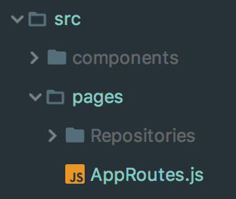
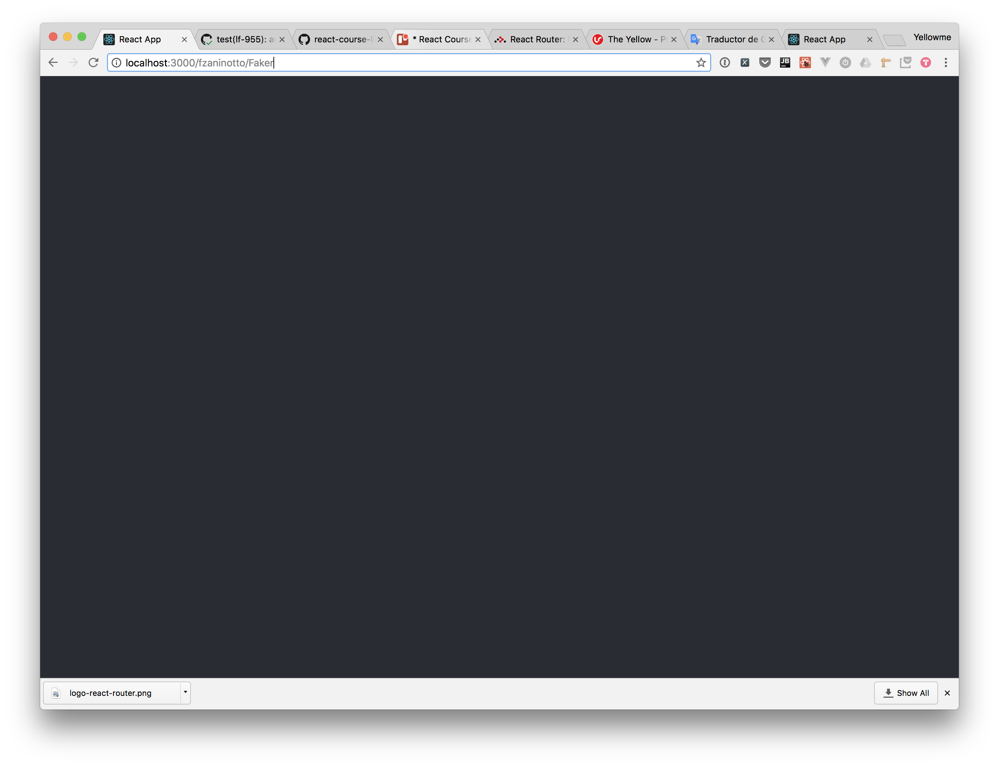
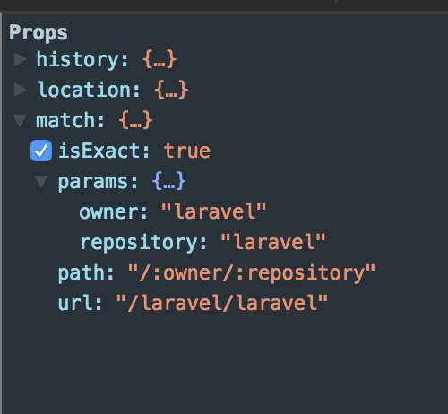
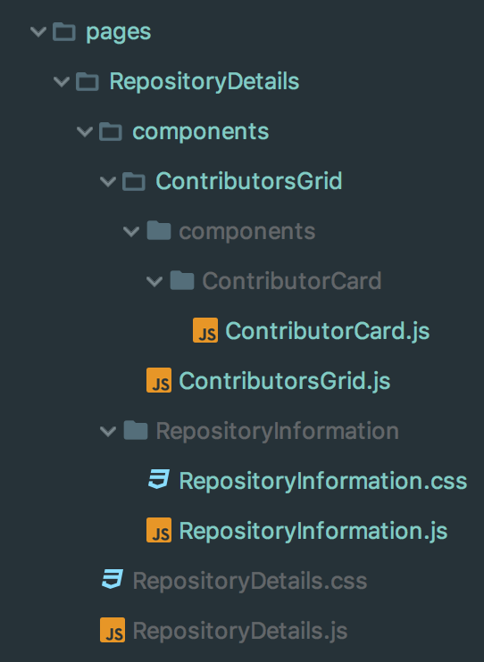

# React Router

![Logo React Router][image-1]

Antes de comentar que es [React Router][1] es necesario explicar por qué es una de las librerías más usadas de React. Mayormente las aplicaciones realizadas con React(o Vue, o Angular) son Single Page Applications(SPAs). Las SPAs son aplicaciones que NO recargan la página por cada interacción del usuario, en cambio, toda la manipulación de datos la realizan de forma oculta(asíncrona) y  tratan de imitar la interacción de una aplicación nativa.  Ejemplos de SPAs son los sitios _Gmail_, _Twitter_, _Inbox_ y _Trello_. 

También existen las Multi Page Applications(MPAs) que por cada interacción del usuario, deben realizar una solicitud al servidor para obtener el HTML de la página que deben de renderizar. Ejemplo de MPAs son la mayoría de sitios de noticias como el Diario de Yucatán.

Nuestra aplicación es una SPA, es decir, se renderiza en una sola página, eso significa que si el usuario hace clic en el botón de atrás, será sacado de nuestra aplicación. Para simular la navegación nativa de un navegador hacemos uso de la librería React Router.

 React Router nos permite:

* Cambiar la URL que despliega el navegador
* Renderizar páginas dependiendo de la URL
* Navegar entre las páginas de nuestra aplicación usando links
* Regresar a la página anterior al hacer clic en el botón de back,
* etc.

## Configuración de React Router

Para instalar React Router ejecutamos el siguiente comando:

```bash
npm install --save  react-router-dom
```

En nuestra aplicación creemos el componente `AppRoutes` en la raíz de nuestra carpeta `pages`.  Este componente será el encargado de relacionar las páginas de la aplicación con las URLs adecuadas.  

<p align='center'>

</p>


Copiemos el siguiente código dentro de nuestro componente `AppRoutes`:

```js
//AppRoutes.js
import React from 'react'
import {
    BrowserRouter as Router,
    Route,
    Switch
} from 'react-router-dom'
import Repositories from "./Repositories/Repositories";


const AppRoutes = () => (
    <Router>
        <Switch>
            <Route exact path="/" component={Repositories}/>
        </Switch>
    </Router>
);

export default AppRoutes;
```

Y cambiemos nuestro component `App` para que utilice `AppRoutes`.

```js
//App.js
import React, {Component} from 'react';
import AppRoutes from "./pages/AppRoutes";

import './App.css';
class App extends Component {

    render() {
        return (
            <div className="app">
                <AppRoutes/>
            </div>
        );
    }
}

export default App;
```


Si todo sale bien deberías de poder ver tu aplicación en el navegador sin problemas. 

## Componentes de React Router

Los componentes `Router, Switch y Route` son de la librería `React Router`, expliquémoslos con más detalle:

### `Router`

Este componente es el encargado de mantener nuestra aplicación en sincronía con la URL que esté en el navegador. Este componente debe de ir lo más alto posible en el árbol de componentes como sea posible. 

### `Route`

Este componente es el encargado de definir la ruta en el que un componente debe ser renderizado. En nuestro caso hemos definido que el componente “Repositories” se renderice cuando el navegador esté en la ruta raiz “/“ de nuestra aplicación. 

Recibe dos props:

* **path:** define la ruta en el que se renderiza
* **component:** define el componente que se va a renderizar

### `Switch`

Este componente se encarga de que solo se renderice el primer componente el cual su path coincida con la URL del navegador. Por ejemplo si tuviéramos dos `Route` sin un \`\`Switch\`\`\`de la siguiente manera: 

```html
<Route exact path="/" component={Repositories}/> //<-- Se renderiza
<Route exact path="/about" component={about}/> //<-- Se renderiza
```

Al entrar a la URL “/“, `React Router` renderizaría ambos componentes debido a que los dos contienen en su path el carácter “/“. En cambio si ponemos un Switch como padre, solo se renderizaría el primer `Route` que coincida.

```html
<Switch>
    <Route exact path="/" component={Repositories}/> // <-- Se renderiza
    <Route exact path="/about" component={about}/>  // <-- NO se renderiza
</Switch>
```

En nuestra aplicación el componente `Repositories` se renderizaría al entrar a la ruta “/”.

```html
<Route exact path="/" component={Repositories}/>
```

### Link

Al hacer clic sobre este componente mandará al usuario a la ruta que tenga especificada en su prop`to`  por ejemplo este Link mandará a la página about al hacer clic sobre él.

```html
<Link to="/about">Go to about page</Link>
```

En el ejemplo anterior al hacer clic sobre este link React Router cambiará la URL del navegador a “/about” y renderizará el `Route` que tenga por “/about” por path.

### NavLink

Tiene la misma funcionalidad que el componente `Link`, la diferencia es que este componente acepta el prop className para poner estilos al link. 

```html
<NavLink className="any-class-you-like" to="/about">Go to about page</NavLink>
```

## Agregando Navegación a nuestro proyecto

Teniendo instalado React Router es hora de utilizarlo en el proyecto. Primero hagamos que las tarjetas en nuestra página de **Buscar repositorios** sean links. Así, cuando el usuario haga clic en una tarjeta se muestre la página de **Detalles del Repositorio**.

El link que usaremos para ir a la página de **Detalles del Repositorio** es similar al que GitHub usa en su página oficial. El link está compuesto de dos partes. La primera es el nombre del dueño del repositorio y la segunda es el nombre del repositorio. Abajo se muestra la estructura y un ejemplo del link.

**Estructura del Link para Detalles del repositorio**

```html
/:owner/:repository
```

**Ejemplo de Link para Detalles del repositorio**

Por ejemplo si el dueño se llama _fzaninotto_ y el nombre de la librería es _Faker_ el link para su página de detalles sería el siguiente:
 
```html
/fzaninotto/Faker
```

Agreguemos el componente NavLink a las tarjetas de los repositorios, convenientemente el atributo `repoUrl` de cada objeto repositorio cuenta con los link para ir a su página de detalles, por lo que nuestro componente `RepositoriesGrid` se vería de la siguiente manera:

```js
import React from "react";
import PropTypes from 'prop-types';
import {NavLink} from 'react-router-dom';

import RepositoryCard from "./components/RepositoryCard/RepositoryCard";
import Grid from "../../../../components/Grid/Grid";

import './RepositoriesGrid.css';


const RepositoriesGrid = ({repositoriesList}) => {
    return (
        <Grid noItemsMessage="No results found">
            {repositoriesList.map(repository => (
                // Agregamos el link a cada tarjeta para
                <NavLink
                    className="repositories__link"
                    to={`/${repository.repoUrl}`}
                    {/*El key siempre va en el componente más alto*/}
                    key={repository.id}
                >
                    <RepositoryCard
                        repository={repository}
                    />
                </NavLink>
            ))}
        </Grid>
    );
};

RepositoriesGrid.propTypes = {
    repositoriesList: PropTypes.arrayOf(PropTypes.shape({
        id: PropTypes.number.isRequired,
        repoUrl: PropTypes.string.isRequired,
    })).isRequired
};

export default RepositoriesGrid;

```


Si todo salió bien, al hacer clic a una de nuestras tarjetas deberíamos de ver una pantalla negra. Esto es debido a que aún no hemos puesto un componente `Route` que indique lo que se debe de renderizar cuando vamos a un link con la estructura `/:owner/:repository `. 


<p align='center'>

</p>


Creemos el componente `RepositoryDetails` y agreguemos un `Route` en el componente `AppRoutes` para definir cuando debe renderizarse. 

```js
//AppRoutes.js
import React from 'react'
import {
    BrowserRouter as Router,
    Route,
    Switch
} from 'react-router-dom'
import Repositories from "./Repositories/Repositories";
import RepositoryDetails from "./Repositories/pages/RepositoryDetails/RepositoryDetails";


const AppRoutes = () => (
    <Router>
        <Switch>
            <Route exact path="/" component={Repositories}/>
            {/*Renderiza esto cuando el link tenga estructura /:owner/:router*/}
            <Route path="/:owner/:repository" component={RepositoryDetails}/>
        </Switch>
    </Router>
);

export default AppRoutes;
```

El path del componente `Route` que renderiza nuestro componente `RepositoryDetails` define la estructura del link donde `:owner` y `:repository` son atributos dinámicos. Es decir que cualquier link que coincida con la estructura hará que se renderice nuestro componente  `RepositoryDetails`. 

Por ejemplo todas las siguientes URLs renderizan al componente `RepositoryDetails `: 

*  laravel/laravel
* /fzaninotto/Faker
* /fzaninotto/Faker/otherthing


Ya tenemos definida nuestra ruta para el componente `RepositoryDetails ` ahora hace falta que muestre los datos del repositorio. Para saber que repositorio es el que debe de mostrar podemos utilizar el link como referencia. Debido a que el _path_ es dinámico para nuestro componente `RepositoryDetails ` React Router nos pasa toda su información via un prop llamado `match`. Si entramos a **React Web Tools** podemos observar que efectivamente nuestro componente `RepositoryDetails` tiene toda la información de la url dentro del prop **match**.


<p align='center'>

</p>

Dentro de nuestro componente RepositoryDetails podemos acceder al prop _match_ desde cualquier parte, así que hagamos que se nos muestre la información en pantalla.

```js
import React, {Component} from 'react';

class RepositoryDetails extends Component {

    render() {
        const {match} = this.props;

        return (
            <div className="repository-details">
                {`owner: ${match.params.owner} repository: ${match.params.repository}` }
            </div>
        );
    }

}

export default RepositoryDetails;
```

## Ahora te toca hacer la página de RepositoryDetails

Ahora que ya tenemos una idea de como funciona React Router te toca hacer el componente `RepositoryDetails`. 

Recuerda que nuestro cliente de GitHub (`githubClient`) cuenta con las siguientes funciones:

* **getRepositoryContributors(owner, repository)**
* **getRepository(owner, repository)**

**Nota:** ambas funciones retorna una promesa.

Cuando nosotros hicimos la página de RepositoryDetails definimos la siguiente estructura de árbol de componentes y reutilizamos los componentes de `Grid, Card, CardDetails, CardItem y CardItem`.

#### Estructura de árbol de componentes

* RepositoryDetails
	* ContributorsGrid
		* ContributorsCard
	* RepositoryInformation

Tu estructura de carpetas debería quedar algo así:

<p align='center'>

</p>


## Referencias

1. [Curso de React Router hecho por los creadores][2]
2. [ SPAs vs MPAs ][3]


[1]:	https://reacttraining.com/react-router/ "React Router"
[2]:	https://tylermcginnis.com/courses/react-router/ "Curso de React Router 4 por los creadores"
[3]:	https://medium.com/@NeotericEU/single-page-application-vs-multiple-page-application-2591588efe58 "SPAs vs MPAs"

[image-1]:	./images/logo-react-router.png