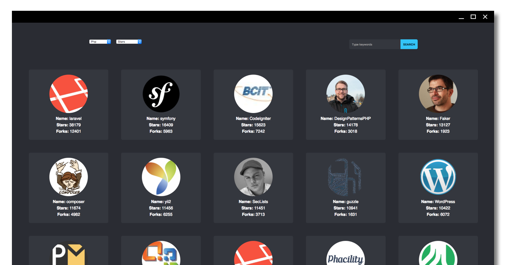

# Curso básico de ReactJS

React es una librería para construir interfaces de usuario en la web (o móvil) que utiliza una arquitectura basada en componentes. En React cada componente contiene todo lo necesario para funcionar y renderizarse por sí mismo, con la intención de disminuir el acoplamiento y mejorar la reusabilidad.

Este es el proyecto final del curso básico de ReactJS impartido por Yellowme.

<p align='center'>

</p>

## Antes de comenzar

Durante el curso se realizará la construcción de una aplicación en la cual podrás Buscar repositorios en GitHub y filtrarlos con base a su popularidad.

Para comenzar deberás descargar este repositorio:

```bash
git clone git@github.com:yellowme/react-course-lite-project.git
```

ó

```bash
git clone https://github.com/yellowme/react-course-lite-project.git
```

### Librerías

Para poder crear aplicaciones con React se debe tener instalados las siguientes librerías y herramientas:

#### Node

Node (versión 6) es un entorno de ejecución que nos servirá como servidor para nuestra aplicación React.

#### Create React App

[Create React App](https://github.com/facebook/create-react-app) es una librería que utiliza `webpack` para automatizar la construcción de un entorno de desarrollo para una aplicación con React y evita la necesidad de tener que configurar todo lo necesario de forma manual.

[Create React App](https://github.com/facebook/create-react-app) construye un entorno de desarrollo con:

* Soporte para React, JSX, ES6, y la sintaxis Flow
* Un servidor de desarrollo con hot-reloading.
* La capacidad de importar CSS e Imágenes directamente a JS.
* Entre otras cosas.

Aunque la librería [Create React App](https://github.com/facebook/create-react-app) no es necesaria para construir una aplicación con React, *se usará durante el curso para evitar construir manualmente nuestro ambiente* de desarrollo.

### Herramientas

Contar con un editor de textos o IDE como:

* Sublime
* Atom
* Webstorm
* VSCode
* Notepad

## Secciones

* [Milla 1](./MILE-01.md)
  * Creación del proyecto
  * Estructura base del proyecto
  * Identificar los Snippets de código
  * Configurar cliente de la API de GitHub
* [Milla 2](./MILE-02.md)
  * Componentes reutilizables
    * LoadingSpinner
    * Grid
    * Card
  * Playground
    * ContributorsCard
* [Milla 3](./MILE-03.md)
  * Página: Buscador de repositorios
    * Trabajar con la API de GitHub
    * Utilizar los componentes: Grid, LoadingSpinner y Card
    * Agregar un SearchBar
    * Configurar tu primera ruta: React Router
* Milla 4
  * Página: Página de un repositorio
